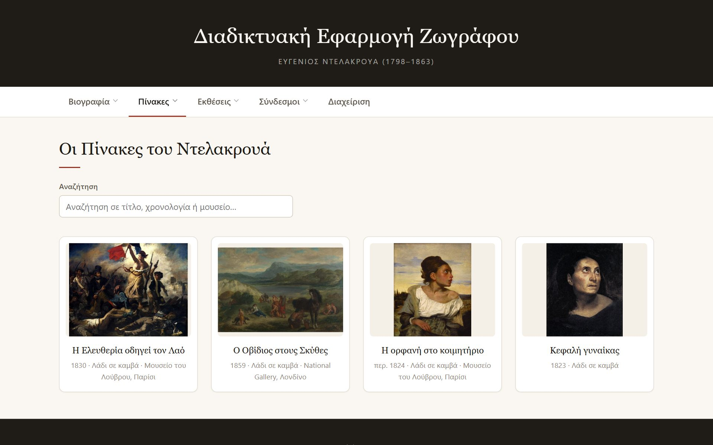
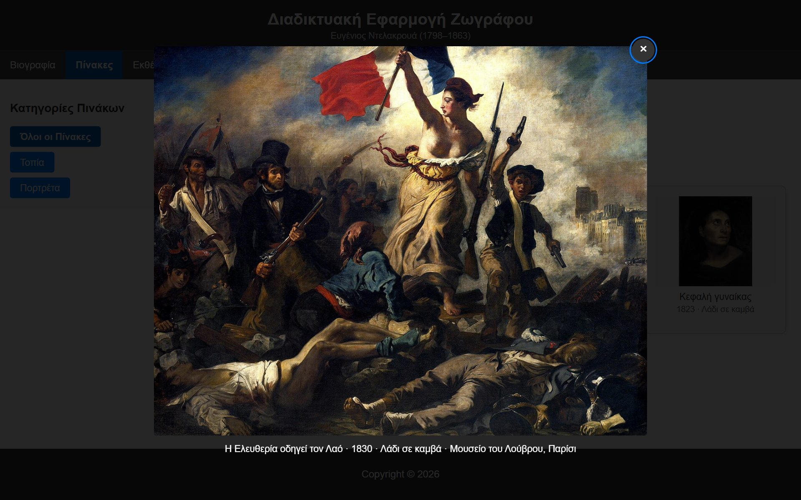
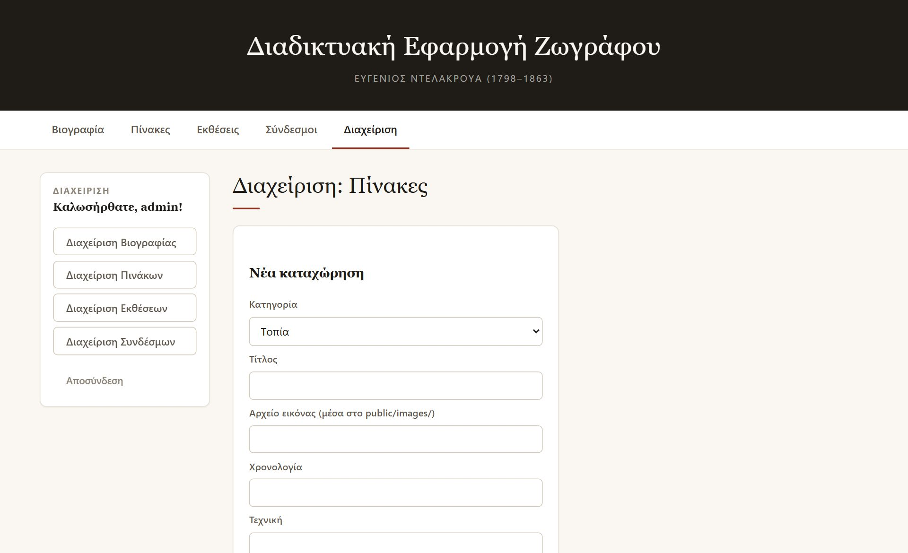

# Eugène Delacroix Web Application

[](https://github.com/Taxma9918/project-site/actions/workflows/ci.yml)

A web application about the painter Eugène Delacroix (1798–1863), featuring a
biography, a gallery of paintings, exhibitions and reference links. Exhibitions
and links are managed from inside the application by an administrator (CRUD).

**Stack:** Node.js + Express (backend), vanilla HTML/CSS/JavaScript (frontend),
JSON files for storage.

> The user interface and the source-code comments are written in Greek.

## Screens

The gallery, grouped by category, with the search box and each work shown with
its year, technique and museum:



Clicking a painting opens it at full size, with its caption:



The administrator screens, where paintings, exhibitions and links are created,
edited and deleted:



## Interface

- **Linkable sections.** Application state lives in the URL hash, so every
  section has its own address — `#/paintings/portraits`,
  `#/links/bibliography`, `#/bio/birth`. Sections can be bookmarked or shared,
  and the browser back and forward buttons work as expected.
- **Lightbox.** Clicking a painting opens it at full size with its caption.
  It closes with Escape, with the close button, or by clicking the backdrop,
  and focus returns to the thumbnail that opened it.
- **Search.** The gallery and the data tables have a filter box that narrows
  what is shown as you type, without another request to the server.
- **Accessibility.** A skip link, `aria-current` on the active menu item, focus
  moved to the main region after navigation, keyboard-operable paintings, and a
  focus trap while the lightbox is open.
- **Loading states**, a favicon, and images with a fixed aspect ratio so the
  layout does not shift as they load.
- **Light image payload.** The grid loads 500 pixel wide copies from
  `public/images/thumbs/`, and only the lightbox fetches the full resolution
  file. That takes the gallery from 940 KB of images down to 193 KB. A painting
  with no thumbnail yet, added through the admin screens, falls back to the full
  image rather than showing a broken icon.

## Installation and usage

Requires Node.js 18 or newer.

```bash
npm install
npm start
```

The application runs at <http://localhost:3000> (or on the port given by the
`PORT` environment variable).

## Development

| Script                  | What it does                                   |
| ----------------------- | ---------------------------------------------- |
| `npm start`             | Runs the server                                 |
| `npm run dev`           | Runs it with `--watch`, restarting on changes   |
| `npm test`              | Runs the test suite                             |
| `npm run lint`          | Runs ESLint over the whole project              |
| `npm run hash-password` | Generates an entry for `data/users.json`        |

### Tests

`npm test` runs 51 tests, split between the server and the browser side.

The 29 server tests drive the real Express application over HTTP and cover
authentication, role permissions, input validation, the full CRUD cycle
including moving an entry between categories, concurrent writes, biography
editing, and error handling. Each file starts its own copy of the app on an ephemeral port,
pointed at a temporary copy of `data/` through the `DATA_DIR` environment
variable, so the suite never touches the real data files. Authentication has
its own file because the login rate limiter keeps state per address, and
`node --test` gives every file a separate process.

The 22 client tests load `public/index.html` and `public/script.js` into jsdom
with a stubbed `fetch`, so the page code runs exactly as written, without a
server or a browser. They cover the hash routing and its defaults, the active
menu marking, the guard on the admin routes, escaping of hostile titles and
`javascript:` links, the thumbnail paths, the lightbox including focus handling
and Escape, the search filter, and restoring a saved session.

Running the suite needs Node 21 or newer, because the script lets the test
runner expand the glob itself.

## Test accounts

| User    | Password   | Role          | Permissions            |
| ------- | ---------- | ------------- | ---------------------- |
| `admin` | `1234`     | administrator | Create/edit/delete     |
| `user`  | `user1234` | visitor       | Read-only              |

Accounts live in `data/users.json`, not in the source. Passwords are **not**
stored in plain text: the file holds salted scrypt hashes, and comparison is
done in constant time (`crypto.timingSafeEqual`).

To add an account or change a password, generate the entry with the helper
script and paste it into `data/users.json`. The password is read from stdin, so
it never lands in your shell history:

```bash
npm run hash-password -- alice admin
```

Repeated failed logins from the same address are throttled: after 5 failures the
endpoint answers `429` for 15 minutes, and a successful login clears the counter.
The counter lives in memory, so restarting the server also clears it. Both limits
are constants near the top of `server.js`.

## Project structure

```
server.js              Express server: authentication + REST API
data/                  Application data, reachable only through the API
  users.json           Accounts: usernames, roles, scrypt hashes
  biography.json       Biography text
  paintings.json       Painting data
  exhibitions.json     Exhibition data
  links.json           Link data
public/                Static files, served as-is
  index.html           Page structure
  styles.css           Styling (responsive)
  script.js            Frontend logic
  favicon.svg          Browser tab icon
  images/              Painting images at full resolution
    thumbs/            Smaller copies used by the gallery grid
render.yaml            Deployment blueprint for Render
.github/workflows/     Continuous integration: lint, tests, production boot
docs/screenshots/      Images used by this README
scripts/
  hash-password.js     Generates an entry for data/users.json
test/                  Test suite (node:test)
  helpers.js           Starts the app on a temporary copy of data/
  api.test.js          Resources, permissions, validation, CRUD
  auth.test.js         Login, tokens, rate limiting
  client-helpers.js    Loads the page into jsdom with a stubbed fetch
  client.test.js       Routing, escaping, lightbox, filter, session
```

## REST API

`GET` requests are public. `POST`, `PUT` and `DELETE` require an
`Authorization: Bearer <token>` header carrying an administrator token.

| Method   | Path                    | Description                          |
| -------- | ----------------------- | ------------------------------------ |
| `POST`   | `/api/login`            | Sign in, returns a token and a role   |
| `POST`   | `/api/logout`           | Invalidate the token                  |
| `GET`    | `/api/me`               | Verify a token, returns the user      |
| `GET`    | `/api/biography`        | Biography text                        |
| `PUT`    | `/api/biography/:section` | Update one biography section        |
| `GET`    | `/api/paintings`        | All paintings, grouped by category    |
| `POST`   | `/api/paintings`        | Create a painting                     |
| `PUT`    | `/api/paintings/:id`    | Update a painting                     |
| `DELETE` | `/api/paintings/:id`    | Delete a painting                     |
| `GET`    | `/api/exhibitions`      | All exhibitions, grouped by category  |
| `POST`   | `/api/exhibitions`      | Create an exhibition                  |
| `PUT`    | `/api/exhibitions/:id`  | Update an exhibition                  |
| `DELETE` | `/api/exhibitions/:id`  | Delete an exhibition                  |
| `GET`    | `/api/links`            | All links, grouped by category        |
| `POST`   | `/api/links`            | Create a link                         |
| `PUT`    | `/api/links/:id`        | Update a link                         |
| `DELETE` | `/api/links/:id`        | Delete a link                         |

### Data format

Each JSON file is an object keyed by category, and every entry carries a unique
`id`:

```json
{
  "current": [
    { "id": 1, "name": "...", "location": "...", "startDate": "2026-03-15", "endDate": "" }
  ],
  "past": []
}
```

`POST` and `PUT` bodies for paintings and links also include a `category` field.
If a `PUT` is given a different category, the entry is moved into it.

Exhibitions are the exception: their category is not chosen but derived from the
dates. An exhibition with no `endDate` counts as permanent and therefore current;
otherwise it is current until its end date passes, and past afterwards. A
`category` sent with the request is ignored, so the two lists cannot drift out of
step with the dates on display.

A painting carries `title` and `image` (both required) plus the optional `year`,
`technique` and `museum`, which are shown under the thumbnail and in the
lightbox caption:

```json
{
  "id": 1,
  "title": "Η Ελευθερία οδηγεί τον Λαό",
  "image": "Eugène_Delacroix_-_La_liberté_guidant_le_peuple.jpg",
  "year": "1830",
  "technique": "Λάδι σε καμβά",
  "museum": "Μουσείο του Λούβρου, Παρίσι"
}
```

### Example

```bash
TOKEN=$(curl -s -X POST localhost:3000/api/login \
  -H "Content-Type: application/json" \
  -d '{"username":"admin","password":"1234"}' | jq -r .token)

curl -X POST localhost:3000/api/exhibitions \
  -H "Authorization: Bearer $TOKEN" \
  -H "Content-Type: application/json" \
  -d '{"category":"current","name":"Exhibition","location":"Athens","date":"2026-04-26"}'
```

## Security notes

- Write endpoints check the token **and** the role on the server, not just in
  the UI.
- All data is escaped before it reaches the DOM, so HTML/JavaScript cannot be
  injected (XSS).
- Links are filtered so that only `http:` and `https:` are allowed.
- The server validates incoming data (required fields, date format, URL format)
  and answers with `400` and an explanatory message.
- The server accepts **only** the known fields of each category. This stops a
  client from adding arbitrary keys to the JSON files, or from forging the `id`
  by sending it in the request body.
- Sessions expire after 30 minutes of inactivity (sliding expiry) and expired
  tokens are periodically cleared from memory.
- Writes to the JSON files are atomic (write to a temporary file, then
  `rename`) and serialized per resource, so concurrent requests cannot corrupt
  or lose data.
- The data files live in `data/`, outside the statically served `public/`
  directory, so they can only be reached through the API.
- A painting's `image` field must be a bare filename with an image extension,
  so it cannot point outside `public/images/`.
- Unknown `/api/*` paths answer with JSON, and malformed request bodies get a
  `400` instead of being reported as a server error.
- Accounts live in `data/users.json` rather than in the source code, and only
  salted scrypt hashes are stored.
- The login endpoint is rate limited (5 attempts per 15 minutes per address), so
  passwords cannot be brute forced.
- Every response carries `X-Content-Type-Options`, `X-Frame-Options`,
  `Referrer-Policy` and a strict `Content-Security-Policy`. The policy needs no
  `unsafe-inline`, because the page has no inline scripts, styles or event
  handlers.

The client keeps its token in `sessionStorage`, so a session survives a page
refresh but is discarded once the tab is closed. After a refresh the token is
verified with `GET /api/me`, because sessions live in the server's memory and
are lost on every restart. A production deployment would need a real database,
HTTPS and persistent session storage.

## Deployment

The application is a plain Node server, so any host that runs Node works
(Render, Railway, Fly.io). It reads the port from `PORT`, which those platforms
set for you, so `npm start` is enough as a start command.

`render.yaml` in the repository root is a ready blueprint for [Render](https://render.com):

1. Push the repository to GitHub (already done).
2. Sign in to Render and choose **New > Blueprint**.
3. Pick this repository. Render reads `render.yaml` and needs nothing else.
4. The first build takes a couple of minutes, then the service gets a public
   `.onrender.com` address.

Two things to expect on the free plan. The service sleeps after roughly fifteen
minutes without traffic, and the next visit takes about a minute to wake it, so
open the link before a presentation rather than during one. And the filesystem
is ephemeral: the data lives in JSON files next to the code, so the `data/`
folder is rewritten from the repository on every restart and redeploy, and
anything added through the admin screens disappears. For a demo that is usually
fine; making it permanent means replacing the JSON files with a real database,
or mounting a persistent disk at `data/`, which needs a paid plan.

## Licence and credits

The source code is released under the ISC licence; see `LICENSE`.

The paintings in `public/images/` are works by Eugène Delacroix (1798-1863) and
are in the public domain. The files come from Wikimedia Commons.
